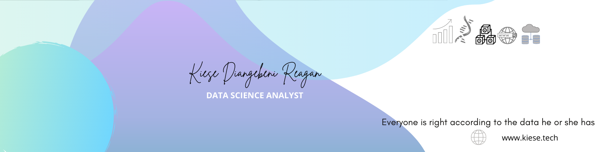

[![alt text][1.1]][1]
[![alt text][2.1]][2]
[![alt text][3.1]][3]
[![alt text][4.1]][4]

[1.1]: https://i.imgur.com/oFsAcMx.png (facebook icon with padding)
[2.1]: https://i.imgur.com/YCdR3o9.png (twitter icon with padding)
[3.1]: https://i.imgur.com/5BWvIrF.png (github icon with padding)
[4.1]: https://i.imgur.com/UA7Oh6z.png (medium icon with padding)
[5.1]: https://imgur.com/gallery/KzIH14p.png

[1]: http://www.facebook.com/reagan.kiese.37
[2]: https://twitter.com/ReaganKiese
[3]: https://github.com/Rekidiang2
[4]: https://medium.com/@rkddatas
[5]: https://kiese.tech/

|          |      |
|--------------|-----------|
|||

**Languages and Tools:**  

<code></code>
<code></code>
<code></code>
<code></code>
<code></code>
<code></code>
<code></code>
<code></code>
<code></code>
<code></code>
<code></code>  

